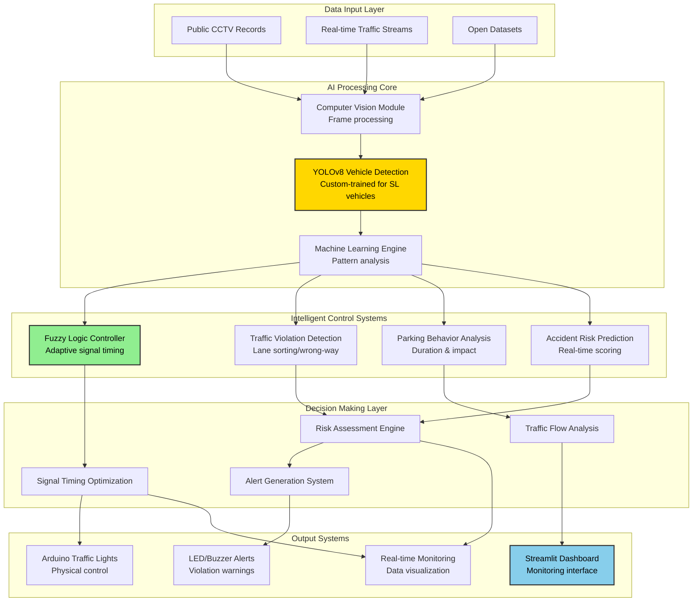

# Intelligent Traffic Management System for Sri Lanka

An intelligent system using Machine Learning and Fuzzy Logic to improve traffic flow and safety in Sri Lankan cities.

[](https://opensource.org/licenses/MIT)
[](https://www.python.org/downloads/)

---

## 📑 Table of Contents

- [Project Overview](#project-overview)
- [System Architecture](#system-architecture)
- [Team Contributions](#team-contributions)
- [Features](#features)
- [Dependencies](#dependencies)
- [Installation](#installation)
- [Project Structure](#project-structure)
- [Development Timeline](#development-timeline)
- [License](#license)

---

## � Project Overview

Sri Lanka's cities face severe traffic congestion from outdated signal systems unable to adapt to unique local traffic patterns, such as the mix of tuk-tuks and buses. This project introduces a prototype system that uses real-time video analysis to create an adaptive, efficient, and safe traffic management solution.

### Key Objectives

1. **Real-time Vehicle Detection and Classification** - Custom YOLOv8 models trained on 3,000+ Sri Lankan traffic images
2. **Adaptive Traffic Signal Control** - Fuzzy logic-driven signal timing optimization
3. **Traffic Violation and Risk Monitoring** - Behavioral analysis and violation detection
4. **Integrated Dashboard and Alert System** - Real-time monitoring and Arduino-based physical alerts

### Problem Statement

- **Outdated Systems**: Static traffic signals unable to adapt to changing conditions
- **Foreign Algorithms**: Failing to detect local vehicle mix (tuk-tuks, overloaded buses)
- **No Real-time Adaptation**: Absence of dynamic response to traffic patterns
- **Safety Concerns**: Increased accident rates due to congestion

---

## 🏗️ System Architecture


### Architecture Overview

1. **Data Acquisition**: Live camera feeds capture real-time traffic conditions at junctions
2. **Vehicle Detection**: YOLOv8 models identify and classify vehicles, violations, and parking behavior
3. **Fuzzy Logic Processing**: Controller analyzes traffic patterns and determines optimal signal timings
4. **Signal Control & Alerts**: Adaptive signaling implemented with Arduino-based warning systems

---

## 👥 Team Contributions

| Member | Component | Description |
|--------|-----------|-------------|
| **Gunarathna R.P** | Parking Behaviour & Traffic Impact Analysis | Custom YOLOv8 for parking detection, DeepSORT tracking, impact analysis |
| **Randima K.M.G.D** | Smart Traffic Violation Detection | Behavioral violation detection, context-aware alerts |
| **Tennakoon I.M.S.R** | Fuzzy Logic Controller | Emergency-responsive signal control, dynamic timing |
| **Palihakkara P.I** | Accident Risk Prediction & Dashboard | Real-time risk scoring, interactive Streamlit dashboard |

---

## ✨ Features

### Component 1: Parking Behaviour & Traffic Impact Analysis *(Gunarathna R.P)*

- **Real-time Parking Detection**: Custom YOLOv8 model detects parked vehicles and roadside activity
- **Duration Tracking**: DeepSORT algorithm estimates parking duration
- **Illegal Parking Detection**: Identifies violations in designated no-parking zones
- **Traffic Impact Analysis**: Calculates flow disruption from roadside parking
- **Arduino Alerts**: LED/buzzer warnings for violations
- **Dashboard Integration**: Real-time data feed to central monitoring

**Novelty**: Two-stage prevention system with voice warnings before penalties, dynamic impact-based fining

### Component 2: Smart Traffic Violation Detection *(Randima K.M.G.D)*

- **Behavioral Detection**: Lane weaving, wrong-way driving, improper stopping
- **Risk Assessment**: Context-aware severity scoring
- **Multi-modal Alerts**: Visual, audio, and data notifications
- **Pattern Recognition**: Repeat offender identification

**Novelty**: Adaptive response system calibrated for Sri Lankan traffic patterns

### Component 3: Fuzzy Logic Controller *(Tennakoon I.M.S.R)*

- **Real-time Optimization**: Dynamic signal timing based on vehicle density
- **Emergency Priority**: Instant routing for ambulances/fire trucks
- **Multi-input Processing**: Vehicle counts, parking data, violations
- **Arduino Simulation**: Physical traffic light control

**Novelty**: Emergency-responsive fuzzy logic with adaptive learning

### Component 4: Accident Risk Prediction & Dashboard *(Palihakkara P.I)*

- **Predictive Risk Scoring**: Multi-factor accident likelihood calculation
- **Interactive Dashboard**: Streamlit-based real-time monitoring
- **Traffic Heatmaps**: Visual congestion and risk mapping
- **Incident Logging**: Comprehensive event history and reporting

**Novelty**: Forward-looking risk assessment with integrated visualization

---

## 📦 Dependencies

### Core Libraries
```txt
# Computer Vision & ML
opencv-python==4.10.0.84
ultralytics==8.3.0              # YOLOv8
torch==2.1.0
torchvision==0.16.0

# Tracking & Detection
deep-sort-realtime==1.3.2

# Fuzzy Logic
scikit-fuzzy==0.4.2
numpy==1.24.3

# Dashboard & Visualization
streamlit==1.28.0
plotly==5.18.0
pandas==2.1.0

# Utilities
pillow==10.4.0
tqdm==4.66.5
```

### Hardware Requirements

- **Camera**: 720p @ 30fps minimum (tested with CCTV footage)
- **Arduino**: Uno/Mega for signal control and alerts
- **LEDs/Buzzers**: For violation warnings
- **Computer**: 
  - CPU: Multi-core (Intel i5/M1 or better)
  - RAM: 8GB minimum, 16GB recommended
  - GPU: NVIDIA GPU with CUDA support (optional, for faster training)

---

## 🚀 Installation

### Prerequisites

- Python 3.8 or higher
- Git

### Setup Instructions

1. **Clone the repository**
```bash
git clone https://github.com/ITMS-Project/intelligent-traffic-management-system.git
cd intelligent-traffic-management-system
```

2. **Create virtual environment**
```bash
# macOS/Linux
python3 -m venv venv
source venv/bin/activate

# Windows
python -m venv venv
venv\Scripts\activate
```

3. **Install dependencies**
```bash
pip install --upgrade pip
pip install -r requirements.txt
```

4. **Verify installation**
```bash
python -c "import cv2; print('OpenCV version:', cv2.__version__)"
python -c "from ultralytics import YOLO; print('YOLOv8 imported successfully')"
```

---

## 📂 Project Structure
```
intelligent-traffic-management-system/
├── data/
│   ├── videos/                    # Raw CCTV footage (not tracked)
│   ├── extracted_frames/          # Processed frames (not tracked)
│   ├── annotations/               # YOLO format labels
│   └── models/                    # Trained model weights
├── src/
│   ├── parking_analysis/
│   │   ├── frame_extractor.py     # Video frame extraction
│   │   ├── train_yolo.py          # YOLOv8 training script
│   │   └── detection.py           # Real-time detection
│   ├── violation_detection/
│   │   └── behavioral_analysis.py
│   ├── fuzzy_controller/
│   │   └── signal_optimizer.py
│   └── dashboard/
│       └── app.py                 # Streamlit dashboard
├── notebooks/                     # Jupyter notebooks for experiments
├── requirements.txt               # Python dependencies
├── README.md                      # This file
└── LICENSE                        # MIT License
```

---

## 📅 Development Timeline

### Phase 1: Data Collection & Preparation ✅ (Oct 17-27, 2025)

- [x] Obtained 155GB CCTV footage from Sri Lanka Traffic Police
- [x] 377 video files covering Baseline and Kanaththa junctions
- [x] Created frame extraction pipeline
- [x] Set up GitHub repository with proper structure

### Phase 2: Dataset Creation ✅ (Oct 28 - Nov 10, 2025)

- [x] Extract representative frames from videos
- [x] Annotate 3,000+ images with parking behaviors
- [x] Integrate external parking violation datasets
- [x] Create synthetic training data for edge cases

### Phase 3: Model Training ✅ (Nov 11 - Nov 25, 2025)

- [x] Train custom YOLOv8 model for vehicle detection
- [x] Implement DeepSORT for vehicle tracking
- [x] Develop traffic impact analysis algorithms
- [x] Test and validate on held-out test set

### Phase 4: System Integration 🔄 (Nov 26 - Dec 10, 2025)

- [ ] Integrate all four components
- [x] Build Streamlit dashboard
- [x] Set up Arduino hardware for physical alerts
- [ ] End-to-end system testing

### Phase 5: Evaluation & Documentation (Dec 11 - Dec 20, 2025)

- [ ] Performance evaluation and metrics
- [ ] Final report and presentation
- [ ] Demo video creation
- [ ] Code documentation and cleanup

---

## 📊 Expected Results

- **Detection Accuracy**: 85%+ on Sri Lankan vehicle dataset
- **Flow Improvement**: 70% reduction in congestion from adaptive signals
- **Violation Reduction**: 65% decrease through real-time alerts
- **Response Time**: <2 seconds for violation detection and alert

---

## 📄 License

This project is licensed under the MIT License - see the [LICENSE](LICENSE) file for details.

---

## 📧 Contact

For questions or collaboration:

- **Project Lead**: Gunarathna R.P (IT22925572@my.sliit.lk)
- **GitHub**: [ITMS-Project](https://github.com/ITMS-Project)
- **Institution**: Sri Lanka Institute of Information Technology (SLIIT)

---

## 🙏 Acknowledgments

- Sri Lanka Traffic Police for providing CCTV footage
- SLIIT Computer Systems Engineering Department
- YOLOv8 by Ultralytics
- Open-source community for various tools and libraries

---